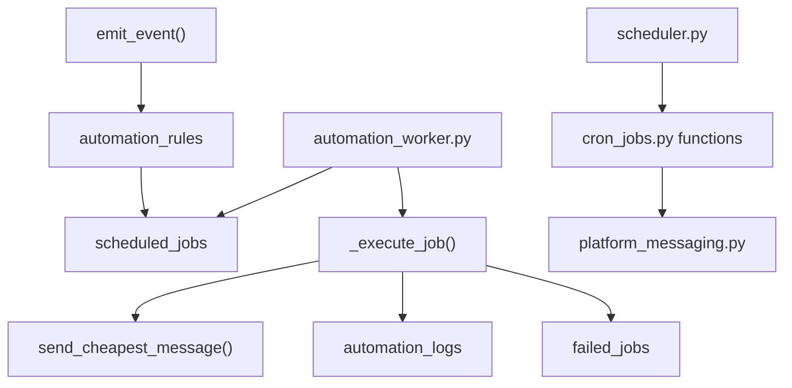

# Automation Engine Playbook

Core files:

- `automation_engine.py`
- `automation_worker.py`
- `scheduler.py`
- `cron_jobs.py`
- `platform_helpers.py`
- `platform_messaging.py`

## Components

## Trigger Types

Implemented event trigger:

- `booking.created`

Default job type:

- `send_message` for `booking.created`
- `automation_log` for other event types

Source:

- `automation_engine._default_job_type()`
- `platform_helpers.insert_booking()` calls `automation_engine.emit_event()`

## Event Flow

Function:

- `automation_engine.emit_event(franchise_id, event_type, payload=None)`

Flow:

1. Validate `franchise_id` and `event_type`.
2. Load franchise.
3. Check `can_run_automation(franchise)`.
4. Load active `automation_rules`.
5. Match `conditions_json` using `_conditions_match()`.
6. Build job payload.
7. Insert `scheduled_jobs`.
8. Write `automation_logs` with status `scheduled`.

## Worker Flow

Entry:

- `automation_worker.run_worker()`

Environment:

- `AUTOMATION_WORKER_INTERVAL_SECONDS`, default 30.
- `AUTOMATION_WORKER_BATCH_SIZE`, default 50.

Flow:

1. `initialize_database()`.
2. Loop forever.
3. Call `process_due_jobs(limit=limit)`.
4. Print processed count.
5. Sleep.

## Job Execution Flow

Function:

- `automation_engine.process_due_jobs(limit=50)`

Flow:

1. Select `scheduled_jobs` with `status='pending'` and due `scheduled_for`.
2. Update job to `running`, set `locked_at`, increment attempts.
3. Re-read claimed job.
4. Execute through `_execute_job()`.
5. On success:
   - set `completed`
   - set `completed_at`
   - write `automation_logs`
6. On failure:
   - if attempts remain, set status `pending` and schedule retry
   - if attempts exhausted, set `failed`
   - write `failed_jobs`

## Retry Logic

Function:

- `_retry_delay_minutes(attempts)`

Backoff:

- attempt 1 -> 1 minute
- attempt 2 -> 5 minutes
- attempt 3 -> 30 minutes
- later -> 60 minutes

Admin retry:

- route `POST /admin/failed-jobs/<int:failed_job_id>/retry`
- function `retry_failed_automation_job()`
- helper `automation_engine.retry_failed_job()`

## Failure Logic

If job fails:

- `scheduled_jobs.last_error` stores error.
- `automation_logs` stores failure.
- `failed_jobs` stores unresolved failed job after max attempts.

If message fails:

- `send_cheapest_message()` logs failed message in `communication_logs`.
- `_execute_job()` raises if message was suppressed.

If worker crashes:

- pending jobs remain pending.
- jobs already marked `running` may not be retried automatically unless manually reset or retry tooling is added.

If database unavailable:

- worker crashes or loops fail.
- Railway should restart service.

If Meta unavailable:

- message send raises.
- job retry logic applies.

## Scheduler Flow

Entry:

- `scheduler.run_scheduler()`

Runs every 300 seconds.

SAST schedule:

- inquiry followups every 5 minutes from 07:00 to 18:00
- same-day reminders at 07:00
- day-before reminders at 08:00
- yearly/service reminders at 09:00
- declined work and missed booking followups at 18:00

Functions called:

- `send_inquiry_followup_jobs()`
- `send_same_day_reminders()`
- `send_day_before_reminders()`
- `send_declined_work_reminders()`
- `send_missed_booking_jobs()`
- `yearly_reminders()`

## Cron Jobs

Entry:

- `python cron_jobs.py <job>`

Supported jobs:

- `daily`
- `monthly`
- `same-day`
- `day-before`
- `yearly`
- `missed`
- `inquiry`
- `automation`
- `subscriptions`
- `billing`

## Duplicate Prevention

- `reminder_campaigns`: unique `idx_reminder_unique_round`.
- `inquiry_followup_events`: unique `idx_inquiry_followup_events_unique`.
- `send_cheapest_message()`: suppresses same recipient/subject within 12 hours.
- `scheduled_jobs`: no unique event/job constraint; duplicate automation rules can create duplicate jobs.

## Monitoring

Check tables:

- `scheduled_jobs`
- `automation_logs`
- `failed_jobs`
- `communication_logs`
- `reminder_campaigns`

Check routes:

- `/admin/client-audit`
- `/admin/failed-jobs/<id>/retry`
- `/reminders`

Check service logs:

- `automation_worker.py` prints "Automation worker started"
- `scheduler.py` prints "Scheduler started..."
- `cron_jobs.py` prints job-specific counts

## Operational Runbook

Worker crash:

1. Check Railway worker service logs.
2. Restart worker.
3. Query `scheduled_jobs` for `running` rows stuck with old `locked_at`.
4. Reset stale rows to `pending` if needed.

Job failure:

1. Open failed jobs route from dashboard/admin context.
2. Inspect `failed_jobs.error_message`.
3. Fix root cause.
4. Use retry route.

Meta outage:

1. Confirm failed `communication_logs.status`.
2. Confirm Meta status externally.
3. Wait or rotate token if auth failure.
4. Retry failed jobs.

Scheduler failure:

1. Restart scheduler.
2. Run `python cron_jobs.py same-day` or needed job manually.
3. Check `reminder_campaigns`.

Database unavailable:

1. Confirm Railway PostgreSQL status.
2. Restore DB connectivity.
3. Restart all services.
4. Run `/health/db`.
