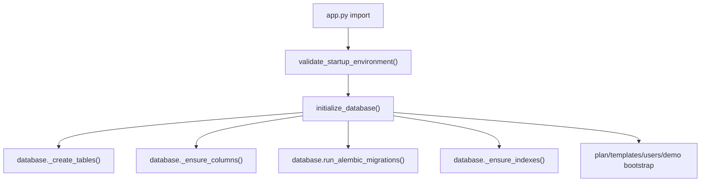
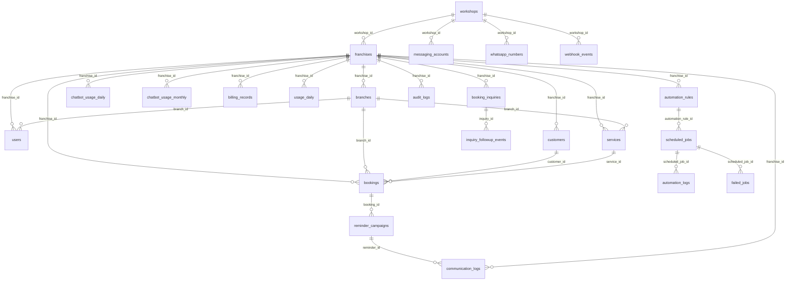

# VANTA Database Flow and Audit

Runtime database authority:

- `database.py`
- `database/migrations/versions/*.py`

Reference/secondary schemas:

- `database/schema/vanta_core.sql`
- `prisma/schema.prisma`

The production runtime is PostgreSQL. SQLite exists as a local fallback unless production markers require PostgreSQL.

## Connection Flow

Connection functions:

- `database.configure_database_url_from_railway_env()`
- `database._database_url()`
- `database._postgres_pool()`
- `database.get_connection()`
- `database.query_db()`
- `database.execute_db()`
- `database.transaction()`

## ERD

## Tables

The field lists below are from `database._create_tables()` and `database._ensure_columns()`.

### workshops

Purpose: SaaS root entity. Runtime franchises map to workshops through `franchises.workshop_id`.

Fields:

- `id`: UUID/TEXT primary key, required.
- `name`: TEXT, required.
- `slug`: TEXT, required, unique index `idx_workshops_slug`.
- `logo_url`: TEXT, optional.
- `phone_number`: TEXT, optional.
- `whatsapp_phone_number_id`: TEXT, optional, legacy/reference.
- `subscription_plan`: TEXT default `starter`.
- `is_active`: BOOLEAN/INTEGER default true.
- `created_at`: TEXT.
- `updated_at`: TEXT.

Risks: Runtime routes mostly use `franchise_id`, not `workshop_id`, so workshop records must remain mapped through `_ensure_workshop_mappings()`.

### franchises

Purpose: Primary runtime tenant/client/business table.

Fields: `id`, `workshop_id`, `name`, `slug`, `contact_email`, `contact_phone`, `notes`, `industry`, `subscription_status`, `subscription_start`, `subscription_end`, `setup_fee`, `public_base_url`, `inbound_webhook_token`, `plan_code`, `branch_limit`, `user_limit`, `automation_enabled`, `chatbot_enabled`, `reporting_enabled`, `custom_integrations_enabled`, `priority_support_enabled`, `monthly_base_price`, `monthly_message_limit`, `messages_used`, `overage_price_per_message`, `billing_day`, `active`, `created_at`, `updated_at`.

Indexes: `idx_franchises_slug`, `idx_franchises_workshop`.

Relationships: one franchise has many branches, users, customers, bookings, billing records, automation rules.

Risks: `inbound_webhook_token` controls booking and Meta webhook route access. Missing token breaks public webhook routes.

### branches

Purpose: Workshop branch/location.

Fields: `id`, `franchise_id`, `name`, `slug`, `code`, `location`, `contact_email`, `contact_phone`, `daily_capacity`, `public_booking_enabled`, `active`, `created_at`, `updated_at`.

Indexes: `idx_branches_franchise_slug`, `idx_branches_franchise`.

Relationships: branch belongs to franchise; branch has users/bookings/reminders.

Risks: Moving branches updates bookings/users in `move_branch()`, but other branch-related records may require review during offboarding.

### users

Purpose: Platform users.

Fields: `id`, `username`, `password`, `password_hash`, `full_name`, `email`, `phone`, `branch`, `company`, `role`, `franchise_id`, `branch_id`, `active`, `must_reset_password`, `last_login`, `created_at`, `updated_at`.

Indexes: `idx_users_franchise`, `idx_users_branch`, `idx_users_username`.

Roles: `super_admin`, `franchise_admin`, `reception`. Future labels exist for `branch_manager`, `technician`, `accounts`, `viewer` but are not fully permissioned.

Risks: `password` legacy column remains; `_harden_default_credentials()` clears plaintext when run. Batch reset route sets temporary `login1234`.

### customers

Purpose: Customer contact records.

Fields: `id`, `franchise_id`, `first_name`, `surname`, `full_name`, `phone`, `email`, `accepts_whatsapp`, `metadata_json`, `created_at`, `updated_at`.

Index: `idx_customers_scope(franchise_id, phone, email)`.

Risks: No hard unique constraint on `franchise_id, phone`; duplicates possible.

### services

Purpose: Service catalog entries created during booking/pricing provisioning.

Fields: `id`, `franchise_id`, `branch_id`, `name`, `category`, `duration_minutes`, `price_amount`, `active`, `metadata_json`, `created_at`, `updated_at`.

Index: `idx_services_scope(franchise_id, branch_id, name)`.

### bookings

Purpose: Core workshop booking/job record.

Fields: `id`, `booking_reference`, `franchise_id`, `branch_id`, `customer_id`, `service_id`, `company`, `branch`, `first_name`, `surname`, `customer_email`, `phone`, `preferred_contact_method`, `make`, `model`, `vehicle_year`, `fuel_type`, `vehicle_vin`, `service`, `service_level`, `current_mileage`, `scheduled_date`, `date`, `status`, `service_due_date`, `work_to_be_done`, `public_notes`, `internal_notes`, `source`, `quote_declined`, `contacted`, `missed_followup_count`, `last_missed_followup_at`, `last_customer_reply_at`, `whatsapp_opt_in`, `privacy_consent_at`, `reminder_opt_in`, `completed_at`, `created_at`, `updated_at`, `legacy_source_key`.

Indexes: `idx_bookings_reference`, `idx_bookings_legacy_source`, `idx_bookings_scope`, `idx_bookings_customer`, migration index `idx_bookings_branch_date_status`.

Relationships: booking belongs to franchise/branch/customer/service and has reminder campaigns and communication logs.

Risks: Status is free text at runtime; no DB enum. UI limits quick status to `Vehicle In` and `Done`, but older statuses exist.

### reminder_campaigns

Purpose: Reminder queue/campaign rows for service reminders, booking reminders, work-to-be-done reminders.

Fields: `id`, `booking_id`, `franchise_id`, `branch_id`, `reminder_kind`, `due_date`, `campaign_round`, `scheduled_for`, `status`, `message_subject`, `message_body`, `last_channel_used`, `send_count`, `created_at`, `updated_at`, `sent_at`.

Index: unique `idx_reminder_unique_round(booking_id, reminder_kind, campaign_round)`.

Risks: Duplicate prevention depends on this unique index and application checks.

### communication_logs

Purpose: Outbound/inbound communication audit log.

Fields: `id`, `booking_id`, `reminder_id`, `franchise_id`, `branch_id`, `user_id`, `channel`, `recipient`, `subject`, `body`, `status`, `external_target`, `created_at`, `sent_at`.

Index: `idx_communication_logs_scope(franchise_id, branch_id, channel)`.

Risks: Message bodies are stored; contains customer communication content.

### whatsapp_numbers

Purpose: Legacy WhatsApp number table.

Fields: `id`, `workshop_id`, `phone_number`, `whatsapp_phone_number_id`, `access_token`, `webhook_verify_token`, `is_active`, `created_at`, `updated_at`.

Indexes: `idx_whatsapp_numbers_phone_id`, `idx_whatsapp_numbers_workshop`.

Status: legacy; `messaging_accounts` is current provider table.

Risks: `access_token` here is not integrated with new encrypted `messaging_accounts` token flow.

### messaging_accounts

Purpose: Current provider account table for Meta WhatsApp Cloud API and future providers.

Fields: `id`, `workshop_id`, `provider`, `channel`, `account_id`, `sender_id`, `business_account_id`, `whatsapp_business_account_id`, `phone_number_id`, `access_token`, `token_encryption_version`, `token_rotated_at`, `token_expiry`, `auth_secret`, `webhook_verify_token`, `webhook_secret`, `embedded_signup_state`, `coexistence_status`, `is_active`, `created_at`, `updated_at`.

Indexes: `idx_messaging_accounts_scope`, `idx_messaging_accounts_phone_id`, unique `idx_messaging_meta_active_workshop`, unique `idx_messaging_meta_active_phone`.

Risks: `MESSAGING_TOKEN_ENCRYPTION_KEY` loss makes encrypted tokens unrecoverable. Only one active Meta account per workshop is allowed.

### webhook_events

Purpose: Meta webhook replay protection.

Fields: `id`, `provider`, `event_id`, `workshop_id`, `phone_number_id`, `event_type`, `created_at`.

Indexes: unique `idx_webhook_events_provider_event`, `idx_webhook_events_scope`.

Risks: Table grows indefinitely without retention policy.

### service_prices

Purpose: Franchise/branch-specific service prices.

Fields: `id`, `franchise_id`, `branch_id`, `service_name`, `service_category`, `price_amount`, `active`, `created_at`, `updated_at`.

Index: `idx_service_prices_scope`.

### chatbot_messages

Purpose: Inbound/outbound chatbot inbox and manual message capture.

Fields: `id`, `franchise_id`, `branch_id`, `customer_name`, `customer_phone`, `customer_email`, `channel`, `direction`, `message_text`, `suggested_service`, `matched_price`, `status`, `processed`, `privacy_notice_sent`, `created_at`, `updated_at`.

Index: `idx_chatbot_messages_scope`.

### booking_inquiries

Purpose: Tracks inquiry followup state and conversion.

Fields: `id`, `franchise_id`, `branch_id`, `booking_id`, `customer_name`, `customer_phone`, `customer_email`, `source_channel`, `user_state`, `service_type`, `last_message_text`, `last_user_interaction_at`, `last_followup_at`, `followup_stage`, `next_followup_at`, `followups_sent_count`, `replies_after_followup_count`, `bookings_from_followups_count`, `stop_reason`, `declined`, `closed_at`, `created_at`, `updated_at`.

Indexes: `idx_booking_inquiries_scope`, unique `idx_booking_inquiries_contact`.

### inquiry_followup_events

Purpose: Prevents duplicate inquiry followups.

Fields: `id`, `inquiry_id`, `followup_stage`, `channel`, `message_subject`, `message_body`, `status`, `sent_at`, `created_at`.

Index: unique `idx_inquiry_followup_events_unique(inquiry_id, followup_stage)`.

### chatbot_usage_daily

Purpose: Daily chatbot/message usage count.

Fields: `id`, `franchise_id`, `usage_date`, `message_count`, `created_at`, `updated_at`.

Index: unique `idx_chatbot_usage_daily_scope`.

### chatbot_usage_monthly

Purpose: Monthly usage billing basis.

Fields: `id`, `franchise_id`, `usage_month`, `message_count`, `message_limit`, `extra_messages`, `base_price`, `overage_price`, `overage_cost`, `total_due`, `payment_status`, `paid_at`, `payment_reference`, `created_at`, `updated_at`.

Index: unique `idx_chatbot_usage_monthly_scope`.

### credential_audit

Purpose: Legacy/specific credential audit history.

Fields: `id`, `user_id`, `username`, `franchise_id`, `actor_user_id`, `event_type`, `note`, `created_at`.

Index: `idx_credential_audit_scope`.

Status: retained for compatibility; centralized `audit_logs` now exists.

### audit_logs

Purpose: Centralized admin/system audit log.

Fields: `id`, `franchise_id`, `branch_id`, `user_id`, `actor_user_id`, `action`, `entity_type`, `entity_id`, `details_json`, `created_at`.

Indexes: `idx_audit_logs_scope`, `idx_audit_logs_entity`.

### paystack_webhook_events

Purpose: Paystack webhook idempotency and history.

Fields: `id`, `event_id`, `reference`, `event_type`, `received_at`, `processed_at`, `status`, `payload_json`.

Indexes: unique `idx_paystack_webhook_events_event`, `idx_paystack_webhook_events_reference`.

### industry_templates

Purpose: Industry defaults for provisioning.

Fields: `id`, `industry`, `name`, `description`, `default_plan`, `default_message_limit`, `active`, `created_at`, `updated_at`.

Index: unique `idx_industry_templates_industry`.

### automation_templates

Purpose: Template automation definitions.

Fields: `id`, `industry`, `name`, `event_type`, `trigger_timing`, `default_delay_minutes`, `default_message`, `channel_priority`, `active`, `created_at`, `updated_at`.

Index: `idx_automation_templates_industry`.

### automation_rules

Purpose: Tenant automation rules derived from templates.

Fields: `id`, `franchise_id`, `branch_id`, `template_id`, `name`, `event_type`, `conditions_json`, `action_json`, `delay_minutes`, `active`, `created_at`, `updated_at`.

Indexes: `idx_automation_rules_scope`, `idx_automation_rules_branch_scope`.

### scheduled_jobs

Purpose: DB-backed automation queue.

Fields: `id`, `franchise_id`, `automation_rule_id`, `job_type`, `payload_json`, `scheduled_for`, `status`, `attempts`, `max_attempts`, `locked_at`, `completed_at`, `last_error`, `created_at`, `updated_at`.

Indexes: `idx_scheduled_jobs_due`, `idx_scheduled_jobs_scope`, migration index `idx_scheduled_jobs_worker`.

### automation_logs

Purpose: Automation job audit log.

Fields: `id`, `franchise_id`, `automation_rule_id`, `scheduled_job_id`, `event_type`, `status`, `message`, `created_at`.

Index: `idx_automation_logs_scope`.

### failed_jobs

Purpose: Failed automation job queue requiring retry/admin action.

Fields: `id`, `franchise_id`, `scheduled_job_id`, `error_message`, `payload_json`, `failed_at`, `resolved`, `resolved_at`.

Index: `idx_failed_jobs_scope`.

### billing_records

Purpose: Closed billing records and Paystack payment links.

Fields: `id`, `franchise_id`, `amount`, `base_amount`, `usage_amount`, `status`, `billing_period`, `payment_reference_id`, `payment_link`, `paid_at`, `created_at`, `updated_at`.

Index: `idx_billing_records_scope`, migration index `idx_billing_unpaid`.

### usage_daily

Purpose: Daily message usage and extra cost tracking.

Fields: `id`, `franchise_id`, `usage_date`, `messages_used`, `extra_messages`, `extra_cost`, `created_at`, `updated_at`.

Index: unique `idx_usage_daily_scope`.

### onboarding_sessions

Purpose: Franchise onboarding session state.

Fields: `id`, `franchise_id`, `industry`, `selected_plan`, `status`, `current_step`, `started_at`, `completed_at`, `created_at`, `updated_at`.

Index: `idx_onboarding_sessions_scope`.

### onboarding_answers

Purpose: Onboarding question answers.

Fields: `id`, `franchise_id`, `session_id`, `question_key`, `answer_value`, `created_at`.

Index: `idx_onboarding_answers_session`.

### onboarding_state

Purpose: High-level onboarding checklist state.

Fields: `id`, `franchise_id`, `setup_progress`, `payment_completed`, `whatsapp_connected`, `services_created`, `automations_enabled`, `go_live_ready`, `created_at`, `updated_at`.

Index: unique `idx_onboarding_state_franchise`.

### feature_flags

Purpose: Tenant feature overrides.

Fields: `id`, `franchise_id`, `feature_key`, `enabled`, `created_at`, `updated_at`.

Index: unique `idx_feature_flags_scope`.

## Migration Chain

1. `20260519_0001_production_constraints.py`
   - Adds production indexes and NOT VALID foreign keys.
2. `20260601_0002_meta_provider.py`
   - Adds Meta provider columns and enum values.
3. `20260601_0003_messaging_security.py`
   - Adds `webhook_events`, Meta account uniqueness.
4. `20260605_0004_audit_paystack_admin.py`
   - Adds `audit_logs`, `paystack_webhook_events`, user last login, token metadata.

## Data Integrity Risks

- Some FK constraints are added as `NOT VALID`; legacy data can remain inconsistent.
- Several runtime relationships are enforced in application code rather than strict DB constraints.
- `customers` can duplicate by phone/email.
- `whatsapp_numbers` legacy table overlaps with `messaging_accounts`.
- `webhook_events` and `communication_logs` need retention policy for long-term scale.
- `booking_reference` generation counts existing references; concurrency could create race without unique retry handling.

## Performance Risks

- `communication_logs` duplicate checks by recipient/subject may need an index if volume grows.
- Scheduler queries scan bookings/reminders across all tenants.
- `chatbot_messages` and `webhook_events` grow indefinitely.
- DB-backed queue in `scheduled_jobs` works for small/medium load but is not a high-throughput queue.
