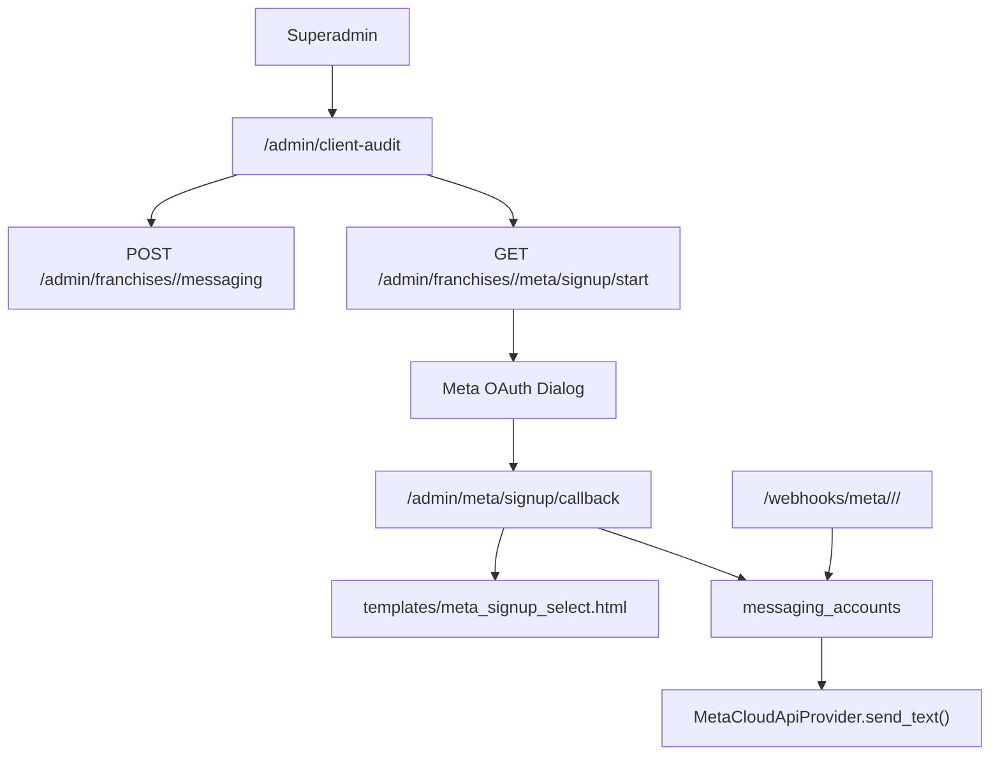

# Meta WhatsApp Owner Guide

Meta code lives mainly in:

- `platform_messaging.py`
- `app.py`
- `database.py`
- `database/migrations/versions/20260601_0002_meta_provider.py`
- `database/migrations/versions/20260601_0003_messaging_security.py`
- `templates/admin_client_audit.html`
- `templates/meta_signup_select.html`
- `tests/test_meta_messaging.py`

## Current Meta Architecture



## Runtime Provider

Provider class:

- `platform_messaging.MetaCloudApiProvider`

Outbound function chain:

- `send_cheapest_message()`
- `active_messaging_account()`
- `send_provider_message()`
- `provider_adapter()`
- `MetaCloudApiProvider.send_text()`

Meta API call:

```text
POST https://graph.facebook.com/v20.0/{phone_number_id}/messages
```

Headers:

- `Authorization: Bearer <decrypted access token>`
- `Content-Type: application/json`

Payload:

- `messaging_product=whatsapp`
- `to=normalize_phone(recipient)`
- `type=text`
- `text.body=body`

## Embedded Signup

Routes:

- `GET /admin/franchises/<int:franchise_id>/meta/signup/start` -> `meta_signup_start()`
- `GET /admin/meta/signup/callback` -> `meta_signup_callback()`

Selection template:

- `templates/meta_signup_select.html`

Flow:

1. Superadmin opens `/admin/client-audit`.
2. Superadmin clicks "Start Meta Signup".
3. `meta_signup_start()` validates `META_APP_ID`.
4. `meta_signup_start()` stores `session["meta_signup_state"]`.
5. User is redirected to Meta OAuth dialog.
6. Meta redirects to `/admin/meta/signup/callback`.
7. `meta_signup_callback()` validates state.
8. Callback exchanges code at `/oauth/access_token`.
9. Callback discovers businesses from `me/businesses`.
10. If multiple businesses exist, it renders `meta_signup_select.html`.
11. Callback discovers WABAs from `{business_id}/owned_whatsapp_business_accounts`.
12. If multiple WABAs exist, it renders `meta_signup_select.html`.
13. Callback discovers phone numbers from `{waba_id}/phone_numbers`.
14. If multiple phone numbers exist, it renders `meta_signup_select.html`.
15. Selected account is written to `messaging_accounts`.
16. `embedded_signup_state` becomes `completed`.
17. Audit is written through `record_audit("meta_embedded_signup_completed", ...)`.

Failure flow:

- `_meta_signup_fail()` sets existing account `embedded_signup_state='failed_discovery'` when possible.
- `_meta_signup_fail()` writes `meta_embedded_signup_failed` to `audit_logs`.
- User is redirected back to `/admin/client-audit`.

## WABA Handling

Database columns:

- `messaging_accounts.business_account_id`
- `messaging_accounts.whatsapp_business_account_id`
- `messaging_accounts.phone_number_id`
- `messaging_accounts.embedded_signup_state`

Multiple WABAs:

- The callback does not silently select a WABA.
- It renders `templates/meta_signup_select.html`.
- User must select the WABA.

Zero WABAs:

- Callback fails with user-facing error.
- Audit action: `meta_embedded_signup_failed`.

One WABA:

- Callback auto-selects the single WABA and proceeds to phone discovery.

## Phone Number Handling

Multiple phone numbers:

- Callback renders `templates/meta_signup_select.html`.
- User selects the number.

Zero phone numbers:

- Callback fails with user-facing error.
- Audit action: `meta_embedded_signup_failed`.

One phone:

- Callback auto-selects the single number.

## Token Management

Token storage:

- `messaging_accounts.access_token`

Encryption functions:

- `platform_messaging.encrypt_access_token()`
- `platform_messaging.decrypt_access_token()`
- `platform_messaging._decrypt_legacy_access_token()`

Required key:

- `MESSAGING_TOKEN_ENCRYPTION_KEY`

New tokens:

- stored with prefix `enc:v2:`
- encrypted using `cryptography.fernet.Fernet`
- `token_encryption_version='v2'`
- `token_rotated_at=utc_now()`

Legacy tokens:

- `enc:v1:` still decrypt through `_decrypt_legacy_access_token()`.

Plaintext:

- rejected unless `ALLOW_PLAINTEXT_MESSAGING_TOKENS=true`.

Rotation:

- Superadmin opens `/admin/client-audit`.
- Existing account edit form posts `account_id` and new `access_token` to `save_messaging_account()`.
- Blank token keeps current token.
- New token rotates to `enc:v2`.

## Webhook Handling

Route:

```text
GET,POST /webhooks/meta/<franchise_slug>/<branch_slug>/<token>
```

Function:

- `app.meta_webhook()`

Verification:

- Route token is compared with `franchises.inbound_webhook_token` by `_validate_required_webhook_token()`.
- GET challenge compares `hub.verify_token` with `messaging_accounts.webhook_verify_token`.
- POST signature uses `X-Hub-Signature-256`.
- `_validate_meta_signature()` computes HMAC SHA-256 using `messaging_accounts.webhook_secret` or `auth_secret`.

Routing:

- `_meta_phone_number_id()` extracts `metadata.phone_number_id`.
- `active_messaging_account(franchise, provider="meta", phone_number_id=phone_number_id)` resolves account.
- `idx_messaging_meta_active_phone` prevents active phone ambiguity.
- `idx_messaging_meta_active_workshop` prevents multiple active Meta accounts per workshop.

Replay:

- `_meta_webhook_events()` builds event IDs.
- `_claim_webhook_event()` inserts into `webhook_events`.
- Duplicate `(provider,event_id)` is ignored.

Inbound message processing:

- `_handle_inbound_customer_message()` inserts `chatbot_messages`.
- `assistant_reply()` may generate reply.
- `send_cheapest_message()` sends reply via active Meta account.

## Multi-Tenant Behavior

VANTA is multi-tenant with shared database and runtime isolation by `franchise_id` and `branch_id`. Meta account isolation uses `workshop_id` through `messaging_accounts`, joined to runtime franchise by `franchises.workshop_id`.

Current active constraints:

- one active Meta account per workshop
- one active Meta phone number ID globally per provider

One number per workshop:

- enforced by `idx_messaging_meta_active_workshop` for active Meta accounts.

Multiple numbers per workshop:

- not supported as active Meta accounts under current unique index.
- would require an architecture change.

## Client Number Setup From Scratch

1. Create or verify Meta Business Portfolio in Meta Business Manager.
2. Complete Business Verification.
3. Create Meta app.
4. Add WhatsApp product.
5. Configure OAuth redirect:

```text
https://<domain>/admin/meta/signup/callback
```

6. Set env vars:

- `META_APP_ID`
- `META_APP_SECRET`
- `META_EMBEDDED_SIGNUP_REDIRECT_URI`
- `MESSAGING_TOKEN_ENCRYPTION_KEY`

7. In VANTA, create franchise and branch.
8. Set `franchises.inbound_webhook_token` in `/manage/franchises`.
9. Open `/admin/client-audit`.
10. Start Meta Signup.
11. Select business/WABA/phone when prompted.
12. Confirm `messaging_accounts` row shows token configured, WABA ID, phone number ID.
13. In Meta dashboard, configure webhook URL:

```text
https://<domain>/webhooks/meta/<franchise_slug>/<branch_slug>/<inbound_webhook_token>
```

14. Set verify token to match `messaging_accounts.webhook_verify_token`.
15. Subscribe webhook fields for messages/statuses.
16. Send test inbound WhatsApp.
17. Confirm `webhook_events`, `chatbot_messages`, and `communication_logs`.

## Meta App Review Requirements

The code requests scopes:

- `business_management`
- `whatsapp_business_management`
- `whatsapp_business_messaging`

Production launch requires Meta app review and approved permissions for the live business/app.

## Operational Checks

Daily:

- Check `/admin/client-audit`.
- Confirm failed messages count.
- Confirm webhook replay history is updating.

After token rotation:

- Send a test message.
- Confirm `communication_logs.status` starts with `sent:meta`.

After webhook registration:

- Meta GET verification should return challenge.
- POST must include valid `X-Hub-Signature-256`.

## Known Risks

- Meta API versions are hardcoded to `v20.0`.
- Webhook route includes branch slug and token, not only phone number ID.
- No automated token refresh capability exists.
- Coexistence support is recorded in `coexistence_status` but no workflow is implemented.
- `whatsapp_numbers` remains a legacy table and should not be used for new Meta setup.
