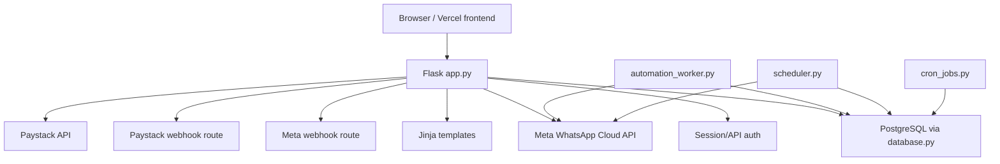
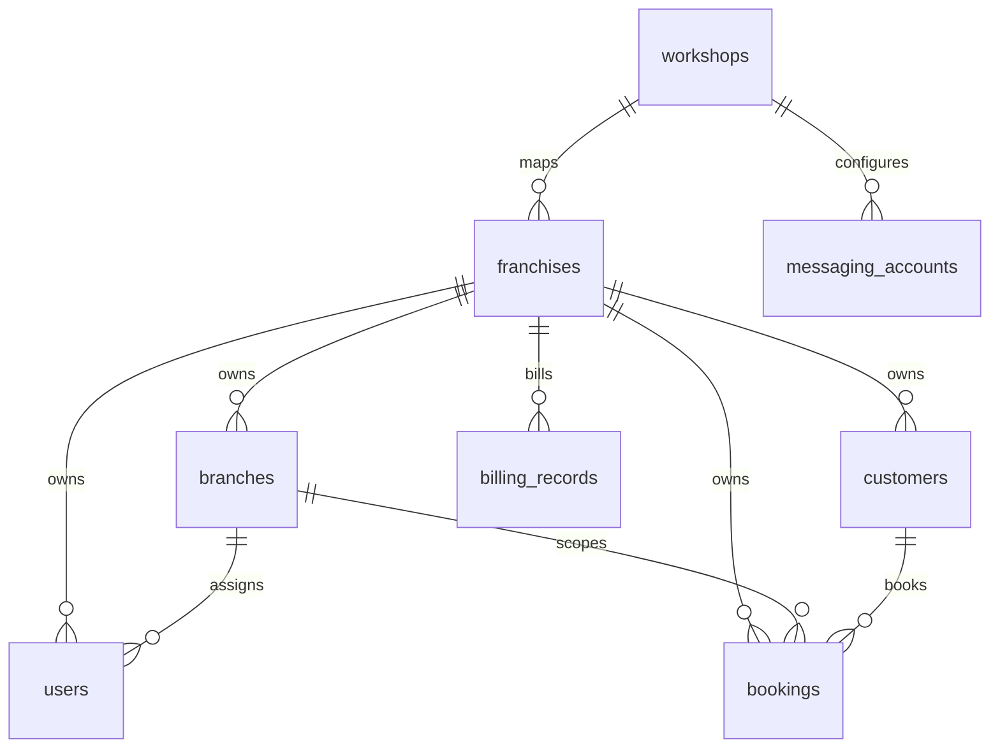
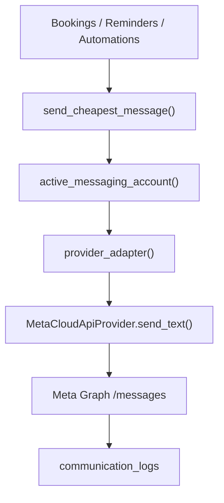
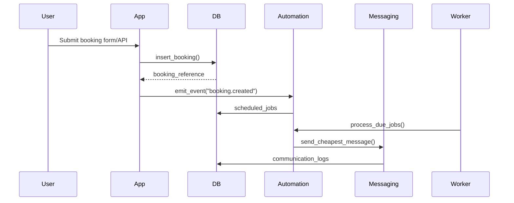

# VANTA System Architecture

## Runtime Architecture

## Frontend Architecture

The repository contains server-rendered Jinja templates in `templates/`. There is no bundled React or Next.js app in this repository. The API routes in `app.py` support an external frontend through:

- bearer token from `POST /api/auth/login`
- `FRONTEND_API_TOKEN`
- optional `FRONTEND_ORIGIN` CORS header

Primary templates:

- `templates/base.html`: layout, navigation, CSRF hidden-input injection.
- `templates/login.html`: login UI.
- `templates/dashboard.html`: operations dashboard.
- `templates/bookings.html`, `templates/booking_detail.html`, `templates/booking_form.html`: booking workflow.
- `templates/manage_franchises.html`: franchise/billing admin.
- `templates/admin_organization.html`: superadmin organization view.
- `templates/admin_client_audit.html`: client audit/integration center.
- `templates/meta_signup_select.html`: Meta asset selection during Embedded Signup.

## Backend Architecture

`app.py` is the main backend. The `routes/` package contains empty Blueprint placeholders and is not the runtime route authority. Runtime route functions are registered directly with `@app.route(...)` in `app.py`.

Core backend modules:

- `database.py`: DB connections, schema bootstrap, migrations, seeders.
- `platform_helpers.py`: RBAC, tenant scoping, billing helpers, booking creation.
- `platform_messaging.py`: WhatsApp provider, reminders, followups, token encryption.
- `automation_engine.py`: job queue, retries, failure logging.
- `services/paystack.py`: Paystack API and webhook idempotency.
- `validators/phone_validator.py`: phone normalization and validation.
- `validators/request_validator.py`: required fields and integer parsing.

## Database Architecture

Production uses PostgreSQL through `DATABASE_URL` or Railway `PG*` variables. Local fallback can use SQLite unless production markers require PostgreSQL.

Runtime tables are created in `database._create_tables()` and reconciled in `database._ensure_columns()`. Indexes are applied in `database._ensure_indexes()`. PostgreSQL migrations are run by `database.run_alembic_migrations()` from `initialize_database()`.

Tenant model:

## Railway Architecture

Files:

- `railway.json`: web start command.
- `Procfile`: `web`, `worker`, `scheduler`, `billing`.
- `Dockerfile`: Python 3.11 slim container.
- `deployment_check.py`: local config validator.

Services:

- `web`: `gunicorn app:app`
- `worker`: `python automation_worker.py`
- `scheduler`: `python scheduler.py`
- `billing`: `python cron_jobs.py billing`

## Worker Architecture

`automation_worker.py`:

- calls `initialize_database()`
- reads `AUTOMATION_WORKER_INTERVAL_SECONDS`
- reads `AUTOMATION_WORKER_BATCH_SIZE`
- loops forever over `automation_engine.process_due_jobs()`

`automation_engine.process_due_jobs()`:

- loads pending `scheduled_jobs`
- marks each job `running`
- executes job action
- marks `completed`
- retries failed jobs with backoff
- writes `automation_logs`
- writes `failed_jobs` when attempts exceed max

## Scheduler Architecture

`scheduler.py` calls `initialize_database()` then loops every 300 seconds. It uses SAST from `platform_messaging.sast_now()`.

Schedule:

- 07:00 SAST: same-day reminders through `send_same_day_reminders()`
- 08:00 SAST: day-before reminders through `send_day_before_reminders()`
- 09:00 SAST: yearly/service reminders through `yearly_reminders()`
- 18:00 SAST: declined work and missed booking followups
- every 5 minutes from 07:00 to 18:00 SAST: inquiry followups

## Messaging Architecture

Provider files/functions:

- `platform_messaging.active_messaging_account()`
- `platform_messaging.provider_adapter()`
- `platform_messaging.send_provider_message()`
- `platform_messaging.MetaCloudApiProvider.send_text()`
- `platform_messaging.encrypt_access_token()`
- `platform_messaging.decrypt_access_token()`

## Billing Architecture

Paystack:

- `platform_helpers.create_payment_link()` calls `services.paystack.initialize_transaction()`.
- Paystack sends webhook to `POST /webhook/paystack`.
- `app.paystack_webhook()` validates signature, claims event idempotently, verifies transaction, then calls `platform_helpers.mark_billing_paid()`.
- `platform_helpers.close_billing_period()` creates/updates `billing_records`.

## Authentication Architecture

UI auth:

- `GET,POST /login` -> `login()`
- session key `user_id`
- `load_current_user()` loads user with franchise/branch labels
- `login_required()` protects normal user pages
- `roles_required()` protects role-specific pages

API auth:

- `POST /api/auth/login` returns token from `_issue_api_token()`.
- `_user_from_api_token()` validates token with `itsdangerous.URLSafeTimedSerializer`.
- `_frontend_api_authorized()` accepts session, bearer token, `FRONTEND_API_TOKEN`, or `ALLOW_PUBLIC_DASHBOARD_API`.

## Request Lifecycle

1. Request enters Flask.
2. `load_current_user()` runs except `/health`.
3. Session or token user is resolved.
4. Route-specific decorators enforce login/role.
5. Route calls helper/query functions.
6. DB operations run through `query_db()` or `execute_db()`.
7. Response returns template or JSON.
8. `add_api_cors_headers()` adds CORS headers for `/api/*`.

## Booking Lifecycle

Functions:

- `platform_helpers.insert_booking()`
- `platform_helpers.upsert_customer()`
- `platform_helpers.ensure_service()`
- `automation_engine.emit_event()`

## Automation Lifecycle

1. Event emitted through `automation_engine.emit_event()`.
2. Active `automation_rules` are matched.
3. `scheduled_jobs` row is inserted.
4. `automation_worker.run_worker()` calls `process_due_jobs()`.
5. Job is locked by status update to `running`.
6. `_execute_job()` sends message or logs automation.
7. Success -> `completed`.
8. Failure -> retry or `failed_jobs`.

## Messaging Lifecycle

Outbound:

1. Business logic calls `send_cheapest_message()`.
2. Duplicate suppression checks `communication_logs` for same recipient/subject within 12 hours.
3. `active_messaging_account()` resolves Meta account by context.
4. Token decrypted by `decrypt_access_token()`.
5. Meta API called by `MetaCloudApiProvider.send_text()`.
6. `communication_logs` and usage counters are updated.

Inbound:

1. Meta calls `/webhooks/meta/<franchise_slug>/<branch_slug>/<token>`.
2. `meta_webhook()` validates route token and signature.
3. `phone_number_id` resolves `messaging_accounts`.
4. `_claim_webhook_event()` prevents replay.
5. `_handle_inbound_customer_message()` stores chatbot message and may reply.

## Billing Lifecycle

1. Usage accumulates in `usage_daily` and `chatbot_usage_monthly`.
2. Superadmin closes month with `/billing/close-month`.
3. `close_billing_period()` creates/updates `billing_records`.
4. Superadmin generates payment link with `/billing/<id>/payment-link`.
5. Paystack webhook calls `/webhook/paystack`.
6. Signature and event idempotency are checked.
7. `verify_transaction()` confirms payment.
8. `mark_billing_paid()` activates subscription for 30 days.

## Client Onboarding Lifecycle

1. Superadmin creates franchise in `/manage/franchises`.
2. `provision_business()` applies plan features, templates, services, onboarding state.
3. Superadmin creates branch in `/manage/branches`.
4. Superadmin/franchise admin creates users in `/manage/users`.
5. Superadmin sets service prices in `/manage/prices`.
6. Superadmin configures Meta in `/admin/client-audit` or starts `/admin/franchises/<id>/meta/signup/start`.
7. Superadmin confirms billing setup through `/manage/franchises`.
8. Client starts using public booking links and dashboard.

## Single Points of Failure

- PostgreSQL database: all web, worker, scheduler, billing paths depend on it.
- `SECRET_KEY`: required for sessions and API tokens.
- `MESSAGING_TOKEN_ENCRYPTION_KEY`: required to decrypt Meta tokens.
- Meta API: WhatsApp delivery fails if unavailable.
- Paystack API: payment link generation and transaction verification fail if unavailable.
- Scheduler service: reminders and followups stop if not running.
- Worker service: automation jobs stop if not running.

## Scaling Bottlenecks

- `automation_worker.py` uses polling rather than a queue backend.
- `scheduler.py` runs a single loop with in-memory daily markers.
- DB connection pool defaults to max 5.
- Messaging sends are synchronous HTTP calls.
- `app.py` is a monolith with all routes in one file.
- `communication_logs` duplicate checks query by recipient/subject and may need more indexing at scale.

## Operational Risks

- `routes/*.py` are placeholder Blueprints and may mislead maintainers.
- Demo users are bootstrapped by `_ensure_demo_access_accounts()`.
- `reset_live_passwords.py` contains a fixed password.
- `ALLOW_PUBLIC_DASHBOARD_API` can expose platform-level API data if enabled.
- Meta Embedded Signup depends on correct external Meta app configuration.
